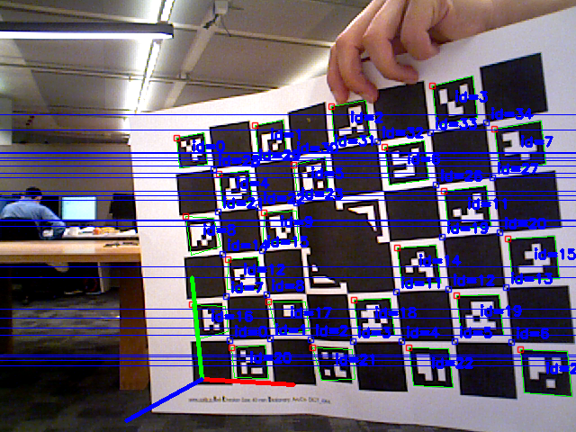
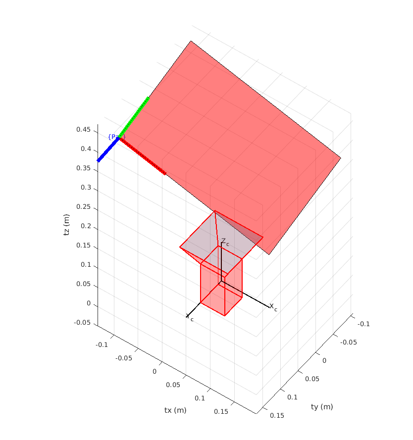
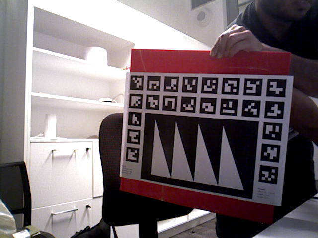

<!-- Improved compatibility of back to top link: See: https://github.com/othneildrew/Best-README-Template/pull/73 -->
<a name="readme-top"></a>
<!--
*** Thanks for checking out the Best-README-Template. If you have a suggestion
*** that would make this better, please fork the repo and create a pull request
*** or simply open an issue with the tag "enhancement".
*** Don't forget to give the project a star!
*** Thanks again! Now go create something AMAZING! :D
-->


<!-- PROJECT SHIELDS -->
<!--
*** I'm using markdown "reference style" links for readability.
*** Reference links are enclosed in brackets [ ] instead of parentheses ( ).
*** See the bottom of this document for the declaration of the reference variables
*** for contributors-url, forks-url, etc. This is an optional, concise syntax you may use.
*** https://www.markdownguide.org/basic-syntax/#reference-style-links
-->

<!-- Find and replace all the following: 

github username: jmehami1
repo name:  mex_ChArUco_Pose


-->

<div align="center">

[![Contributors][contributors-shield]][contributors-url]
[![Forks][forks-shield]][forks-url]
[![Stargazers][stars-shield]][stars-url]
[![Issues][issues-shield]][issues-url]
[![MIT License][license-shield]][license-url]
[![reposize][reposize-shield]][reposize-url]

[![LinkedIn][linkedin-shield]][linkedin-url]
[![portfolio][portfolio-shield]][portfolio-url]

</div>

<h1 align="center">MATLAB MEX functions for ChArUco and ArUco Boards</h1>

<p align="center">
   
    
</p>

---

**Table of Contents**

- [About](#about)
- [Requirements](#requirements)
- [Building Mex Functions](#building-mex-functions)
- [ChArUco Board](#charuco-board)
  - [Detected Pose](#detected-pose)
- [ArUco Board](#aruco-board)
  - [Detected Marker and Pose](#detected-marker-and-pose)
- [TODO](#todo)
- [License](#license)
- [Contact](#contact)
- [Acknowledgments](#acknowledgments)

---

## About

MATLAB MEX functions to estimate the pose of ArUco and ChArUco calibration boards which is implemented in C++ openCV.

**CharucoPosEst.mex**

The MATLAB MEX function for getting the pose of a ChArUco board from the native OpenCV implementation in C++. Link to relevant OpenCV documentation can be found [here](https://docs.opencv.org/4.5.5/df/d4a/tutorial_charuco_detection.html).


**ArucoPixDect.mexa64**

The MATLAB MEX function for getting the identified markers of a ArUco board in pixel coordinates from the native OpenCV implementation in C++. This does **NOT** estimate the pose of an ArUco board. The pose can be estimated using an implmentation of the Perspective-n-Point algorithms such as [IPPE](https://au.mathworks.com/matlabcentral/fileexchange/56571-tobycollins-ippe).

The MEX functions should be located in the `bin` directory with a  `.mexa64` file type (assuming if built on x64 Linux OS). There are included MATLAB test scripts to check if the functions work.


**Please Note**: The printed markers **must** have a surrounding white border in order to be detected

<p align="right">(<a href="#readme-top">back to top</a>)</p>

## Requirements

- MATLAB 2018a or higher (Tested with 2021b)
- GCC 7.0 or higher (Tested with 7.5.0)
- OpenCV 4.0 or higher

## Building Mex Functions

Create a `build` directory inside current directory.

In a terminal pointing to build run the following:

```bash
cmake ..
make 
```

The built MEX functions can be found in the  `bin`  directory.

<p align="right">(<a href="#readme-top">back to top</a>)</p>


## ChArUco Board

Run the MEX function in MATLAB as follows:

```matlab
[rotMat, trans, found, imageOut, numDetectedMarkPts] = CharucoPosEst(image, intrinsicMatrix, distCoefCV, numOfCols, numOfRows, checkerSideLen, arucoSideLen);
```

| Output             | Description                                                  |
| ------------------ | ------------------------------------------------------------ |
| rotMat             | Estimated 3x3 rotation matrix of extrinsic pose or pose of the board w.r.t to the camera's coordinate frame. |
| trans              | Estimated 1x3 translation vector of extrinsic pose or pose of the board w.r.t to the camera's coordinate frame. |
| found              | true/false if the pose of the board could be estimated from the image |
| imageOut           | Copy of input image with drawn 3D axis, detected markers and their IDs |
| numDetectedMarkPts | Number of detected marker points used to estimate pose       |

Check the test script for further information on how to use the function. Test image of 6x8 ChArUco board with 4x4 ArUco dictionary is shown below. Note that centre of board is covered to highlight advantages of ArUco marker board.

<p align="center">
  
</p><br clear="left">

### Detected Pose

Origin is located in the bottom-left corner of the bottom-left marker as shown. Note that the board in test image is not rigid so that is why the axis is off. The extrinsic pose of the camera, the pose of the board in the coordinate frame of the camera, is shown in the right image.

<p align="center">
	
	 
</p><br clear="right">


<p align="right">(<a href="#readme-top">back to top</a>)</p>

## ArUco Board

This MEX function identifies the markers that are present in the passed in image and returns their IDs and pixel corner locations to MATLAB. It does NOT estimate the pose of the board, this will need to be done by an Perspective-n-Point algorithm in MATLAB. 

 Run the MEX function in MATLAB as follows:

```matlab
[ids, markerCorner, imageOut] = ArucoPixDect(image);
```

| Output       | Description                                                  |
| ------------ | ------------------------------------------------------------ |
| ids          | Detected marker IDs from image                               |
| markerCorner | The pixel coordinates of the corners for each of the detected marker IDs |
| imageOut     | Copy of input image with drawn detected markers and their IDs, and any rejected markers |

Check the test script for further information on how to use the function. Test image of a custom 5x8 ArUco board with 4x4 ArUco dictionary is shown below. Note that the missing markers are not included as apart of the setup of the board. 

<p align="center">
  
</p><br clear="left">
<p align="right">(<a href="#readme-top">back to top</a>)</p>

### Detected Marker and Pose

The MEX function detects the markers of the board that are present in the image. The detected markers can be identified using their marker ID as shown on the left image below. In order to estimate the pose to board, we need the corners of the detected marker as shown on the right image below.

<p align="center">
	
	
</p><br clear="left">

The estimated extrinsic is shown below. The origin of the board is located in the bottom-left corner of the bottom-left marker. Note that the board in the test image is not rigid so that is why the axis is slightly off. The extrinsic pose of the camera, the pose of the board in the coordinate frame of the camera, is shown in the right image.

<p align="center">
	
	
</p><br clear="left">

The extrinsic (or the pose of the board w.r.t. the camera's coordinate frame) is found using the [extrinsics function](https://au.mathworks.com/help/vision/ref/estimateextrinsics.html) built into MATLAB's computer vision toolbox. Note that this function is not robust as it estimates the pose in a linear manner using SVD. Use [IPPE](https://au.mathworks.com/matlabcentral/fileexchange/56571-tobycollins-ippe) instead which estimates the extrinsic through optimisation of reprojection error. The function `ArucoPosEst` uses the IPPE library to estimate the extrinsic of the ArUco board as follows:

```matlab
[rotMat, trans, found, imgOut, worldPts] = ArucoPosEst(img, markerCornerCell, cameraParams, doUndistortion);
```

## TODO

- [ ] Complete the ArUco board pose estimation using PnP algorithm built into OpenCV

<p align="right">(<a href="#readme-top">back to top</a>)</p>

## License

Distributed under the MIT License. See `LICENSE.txt` for more information.

<p align="right">(<a href="#readme-top">back to top</a>)</p>

## Contact

[Jasprabhjit Mehami](linkedin-url)

Email: jasprabhjit.mehami@gmail.com

<p align="right">(<a href="#readme-top">back to top</a>)</p>

<!-- ACKNOWLEDGMENTS -->

## Acknowledgments

* [Robotics Toolbox for MATLAB](https://github.com/petercorke/robotics-toolbox-matlab)

* [IPPE for MATLAB](https://github.com/tobycollins/IPPE)

  

<p align="right">(<a href="#readme-top">back to top</a>)</p>

<!-- MARKDOWN LINKS & IMAGES -->
<!-- https://www.markdownguide.org/basic-syntax/#reference-style-links -->


[contributors-shield]: https://img.shields.io/github/contributors/jmehami1/mex_ChArUco_Pose.svg?style=plastic&logo=appveyor
[contributors-url]: https://github.com/jmehami1/mex_ChArUco_Pose/graphs/contributors
[forks-shield]: https://img.shields.io/github/forks/jmehami1/mex_ChArUco_Pose.svg?style=plastic&logo=appveyor
[forks-url]: https://github.com/jmehami1/mex_ChArUco_Pose/network/members
[stars-shield]: https://img.shields.io/github/stars/jmehami1/mex_ChArUco_Pose.svg?style=plastic&logo=appveyor
[stars-url]: https://github.com/jmehami1/mex_ChArUco_Pose/stargazers
[issues-shield]: https://img.shields.io/github/issues/jmehami1/mex_ChArUco_Pose.svg?style=plastic&logo=appveyor
[issues-url]: https://github.com/jmehami1/mex_ChArUco_Pose/issues

[license-shield]: https://img.shields.io/github/license/jmehami1/mex_ChArUco_Pose
[license-url]: https://github.com/jmehami1/mex_ChArUco_Pose/blob/master/LICENSE.txt
[reposize-shield]: https://img.shields.io/github/repo-size/jmehami1/mex_ChArUco_Pose.svg?style=plastic&logo=appveyor
[reposize-url]: https://github.com/jmehami1/mex_ChArUco_Pose


[linkedin-shield]: https://img.shields.io/badge/-LinkedIn-blue.svg?style=for-the-badge&logo=linkedin&colorB=0077b5
[linkedin-url]: https://linkedin.com/in/jessemehami
[portfolio-shield]: https://img.shields.io/badge/-Portfolio-blue.svg?style=for-the-badge&logo=Portfolio&colorB=625094
[portfolio-url]: https://jmehami1.github.io/